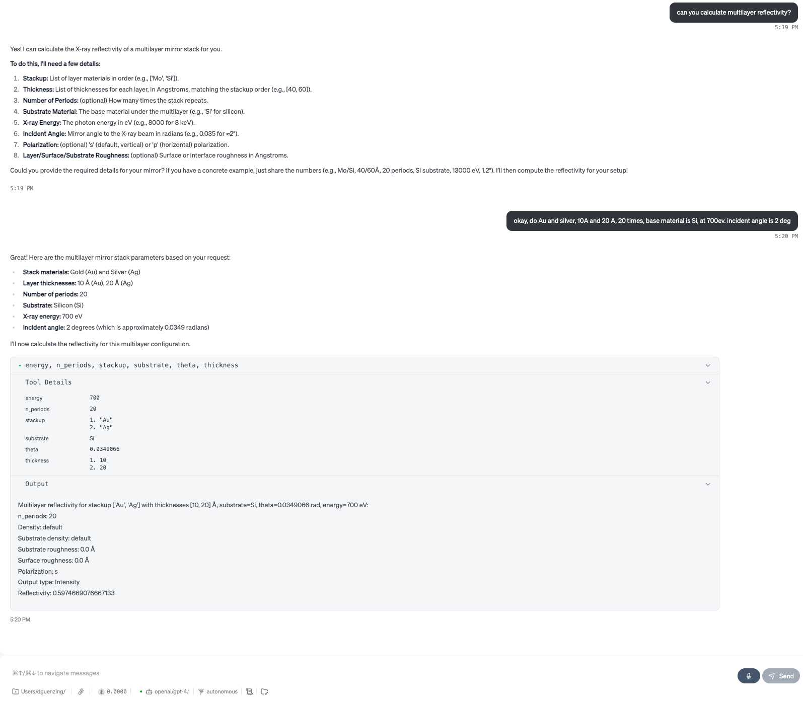
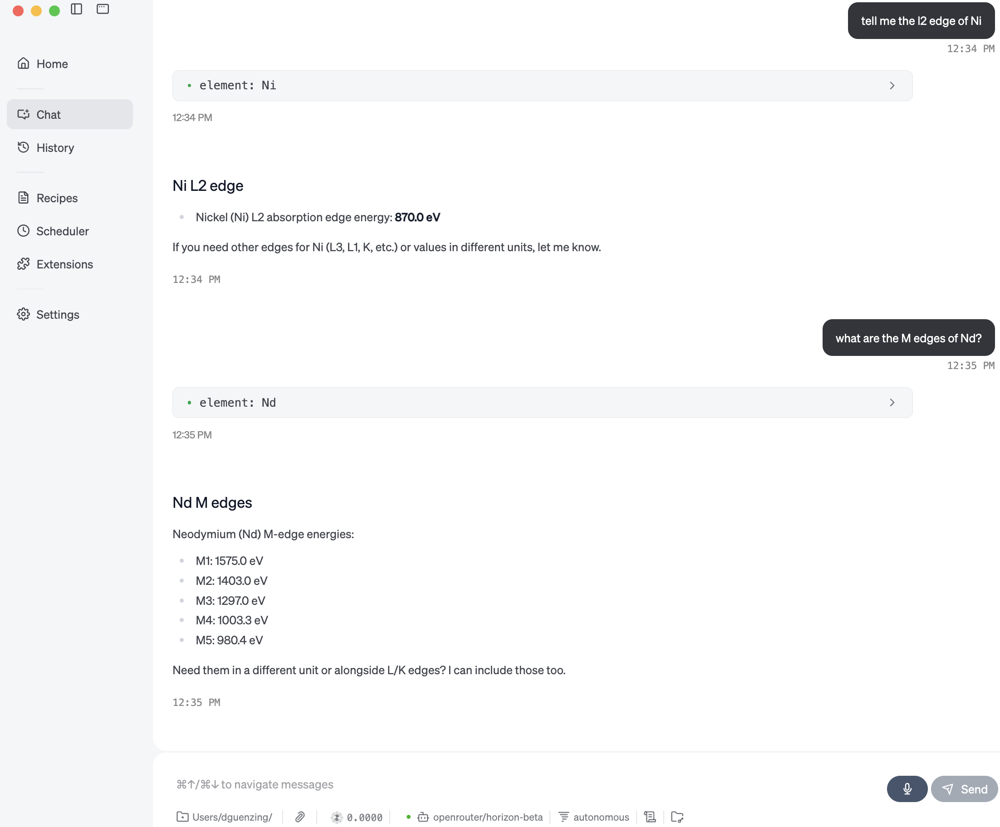
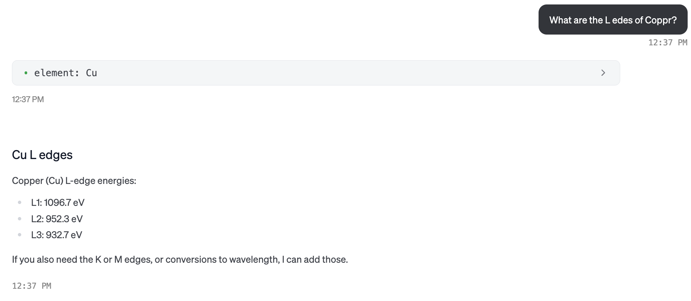
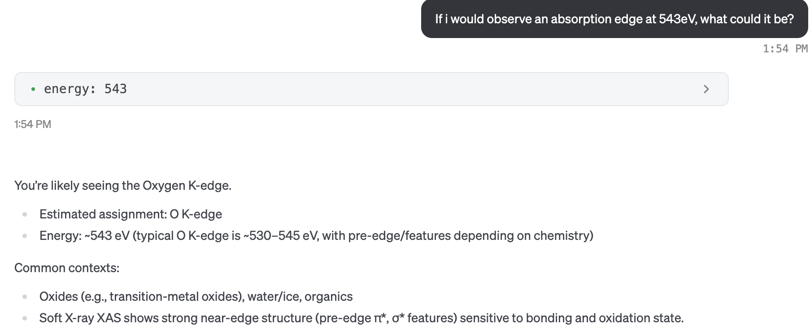
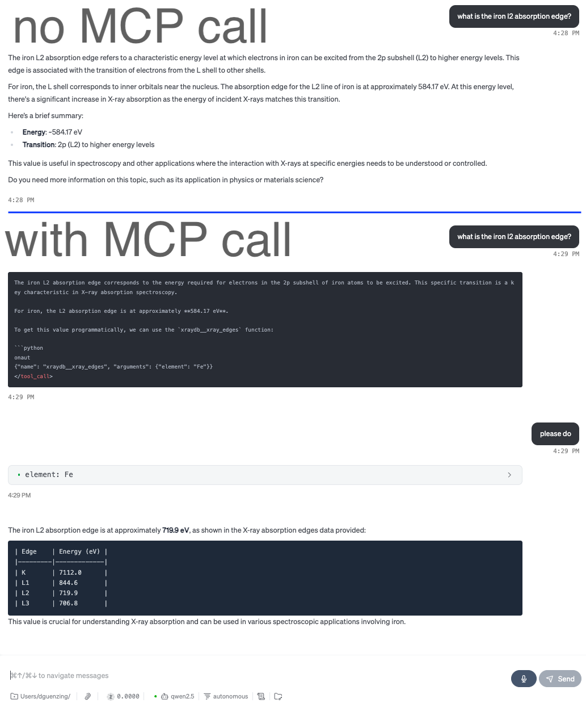

# XrayDB MCP Server
Prototype of a Model Context Protocol (MCP) server that provides access to X-ray properties of elements via the [XrayDB](https://github.com/xraypy/XrayDB) library.

Cool is that this repo/server has only 2 `pip` installable dependencies:
- `mcp` for the protocol
- `xraydb` for the tool usage

So far implemented:

1. `xray_edges` – Get X-ray absorption edges for an element.
2. `xray_edge` – Get data for a specific X-ray absorption edge.
3. `guess_edge` – Guess element and edge from energy.
4. `atomic_number` – Return atomic number for an element.
5. `atomic_density` – Return atomic density for an element.
6. `mirror_reflectivity` – Calculate reflectivity for a single-layer mirror.
7. `multilayer_reflectivity` – Calculate reflectivity for a multilayer mirror stack.
8. `material_mu` – Get X-ray attenuation length for a material.
9. `chantler_energies` – List Chantler tabulated energies for an element.
10. `f0` – Get elastic X-ray scattering factor for an ion.
11. `f0_ions` – List supported ions for f0 calculation.
12. `chantler_data` – Get data from Chantler tables for an element and energy.
13. `f1_chantler` – Get real part of anomalous scattering factor (f1) from Chantler.
14. `f2_chantler` – Get imaginary part of anomalous scattering factor (f2) from Chantler.
15. `mu_chantler` – Get mass attenuation coefficient (mu/rho) from Chantler tables.
16. `lambert_beer` – Calculate X-ray transmission using Lambert-Beer law.
17. `mu_elam` – Get mass attenuation coefficient from Elam tables.
18. `coherent_cross_section_elam` – Get coherent scattering cross-section from Elam.
19. `incoherent_cross_section_elam` – Get incoherent scattering cross-section from Elam.
20. `xray_lines` – List X-ray emission lines for an element.
21. `xray_line` – Get data for a specific X-ray emission line.
22. `coated_reflectivity` – Calculate reflectivity for a coated mirror.
23. `ionchamber_fluxes` – Calculate ion chamber and PIN diode fluxes.
24. `dynamical_theta_offset` – Calculate angular offset from Bragg diffraction.
25. `transmission_sample` – Analyze transmission mode sample composition.
26. `formula_to_mass_fracs` – Calculate mass fractions from a formula.
27. `mass_fracs_to_molar_fracs` – Convert mass fractions to molar fractions.
28. `validate_mass_fracs` – Validate and normalize mass fractions.

## Showcase

More complicated multilayer reflectivity calculations are possible:



Showcased using [goose](https://github.com/block/goose/) with the free horizon-beta LLM accessed via openrouter.



It is relatively typing error agnostic too:



It can also suggest an element and corresponding edge for an energy:



It runs local using a 0.5B qwen2.5 (ca. 400MB) model with ollama: 



# Installation

## Using [uv](https://github.com/astral-sh/uv)

You can install the dependencies in a virtual environment using [uv] and pip:

```sh
uv venv
uv pip install -r requirements.txt
```

## Running the MCP Server

After installing the dependencies, you can start the MCP server with:

```sh
uv run </path/to/dir>/src/server.py
```

This will launch the server and make the XrayDB endpoints available via the MCP protocol. You can add it now in your favorite IDE. Highly recommend [goose](https://block.github.io/goose/).
